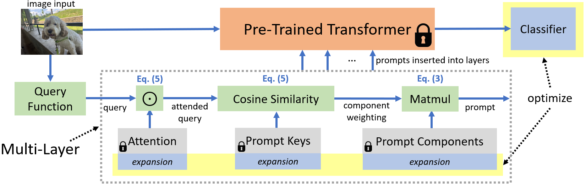

##  CODA-Prompt: COntinual Decomposed Attention-based Prompting for Rehearsal-Free Continual Learning
PyTorch code for the CVPR 2023 paper:\
**CODA-Prompt: COntinual Decomposed Attention-based Prompting for Rehearsal-Free Continual Learning**\
**_[James Smith]_**, *Leonid Karlinsky, Vyshnavi Gutta, Paola Cascante-Bonilla*\
*Donghyun Kim, Assaf Arbelle, Rameswar Panda, Rogerio Feris, Zsolt Kira* \
IEEE/CVF Conference on Computer Vision and Pattern Recognition (CVPR), 2023\
[[arXiv]]

<p align="center">

</p>

## Abstract
Computer vision models suffer from a phenomenon known as catastrophic forgetting when learning novel concepts from continuously shifting training data. Typical solutions for this continual learning problem require extensive rehearsal of previously seen data, which increases memory costs and may violate data privacy. Recently, the emergence of large-scale pre-trained vision transformer models has enabled prompting approaches as an alternative to data-rehearsal. These approaches rely on a key-query mechanism to generate prompts and have been found to be highly resistant to catastrophic forgetting in the well-established rehearsal-free continual learning setting. However, the key mechanism of these methods is not trained end-to-end with the task sequence. Our experiments show that this leads to a reduction in their plasticity, hence sacrificing new task accuracy, and inability to benefit from expanded parameter capacity. We instead propose to learn a set of prompt components which are assembled with input-conditioned weights to produce input-conditioned prompts, resulting in a novel attention-based end-to-end key-query scheme. Our experiments show that we outperform the current SOTA method DualPrompt on established benchmarks by as much as 5.4% in average accuracy. We also outperform the state of art by as much as 6.6% accuracy on a continual learning benchmark which contains both class-incremental and domain-incremental task shifts, corresponding to many practical settings.

## Important notice!
We received feedback from other researchers that our orthogonality initialization might not be “in the spirit” of continual learning. **So, we fixed it!** Our code now uses the Gram-Schmidt process at the start of each new task to initialize new prompting parameters. We found that, with this initialization, we can even set the ortho penalty of our method to 0.0! We hope this might inspire future work, as well. Send me a message if you want to discuss more (email preferred).

## Setup
 * Install anaconda: https://www.anaconda.com/distribution/
 * set up conda environmet w/ python 3.8, ex: `conda create --name coda python=3.8`
 * `conda activate coda`
 * `sh install_requirements.sh`
 * <b>NOTE: this framework was tested using `torch == 2.0.0` but should work for previous versions</b>
 
## Datasets
 * Create a folder `data/`
 * **CIFAR 100**: should automatically be downloaded
 * **ImageNet-R**: retrieve from: https://github.com/hendrycks/imagenet-r
 * **DomainNet**: *coming soon*!

## Training
All commands should be run under the project root directory. **The scripts are set up for 4 GPUs** but can be modified for your hardware.

```bash
sh experiments/cifar100.sh
sh experiments/imagenet-r.sh
```

## Results
Results will be saved in a folder named `outputs/`. To get the final average accuracy, retrieve the final number in the file `outputs/**/results-acc/global.yaml`

## Ready to create your next method?
Create your new prompting method in `models/zoo.py`, which will require you to create a new class in `learners/prompt.py` as well. Hopefully, you can create your next method while only modifying these two files! I also reccomend you develop with the ImageNet-R benchmark and use fewer epochs for faster results. **Cannot wait to see what method you develop!**

## Model backbone
For fair comparisons with our method and results, please see models/zoo.py to take or replace the exact pre-trained vit_base_patch16_224 weights used in our repo.

## Note on setting
Our setting is rehearsal-free class-incremental continual learning. Our method has not been tested for other settings such as domain-incremental continual learning.

## Acknowledgement
This material is based upon work supported by the National Science Foundation under Grant No. 2239292.

## Citation
**If you found our work useful for your research, please cite our work**:
    
    @InProceedings{Smith_2023_CVPR,
        author    = {Smith, James Seale and Karlinsky, Leonid and Gutta, Vyshnavi and Cascante-Bonilla, Paola and Kim, Donghyun and Arbelle, Assaf and Panda, Rameswar and Feris, Rogerio and Kira, Zsolt},
        title     = {CODA-Prompt: COntinual Decomposed Attention-Based Prompting for Rehearsal-Free Continual Learning},
        booktitle = {Proceedings of the IEEE/CVF Conference on Computer Vision and Pattern Recognition (CVPR)},
        month     = {June},
        year      = {2023},
        pages     = {11909-11919}
    }

[James Smith]: https://jamessealesmith.github.io/
[arXiv]: https://arxiv.org/abs/2211.13218
